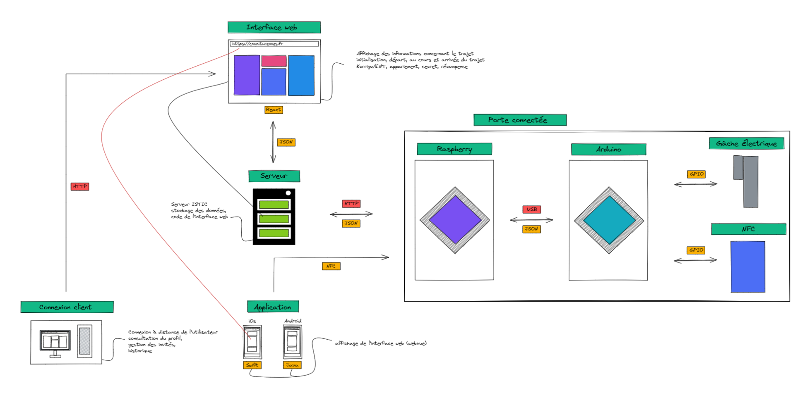
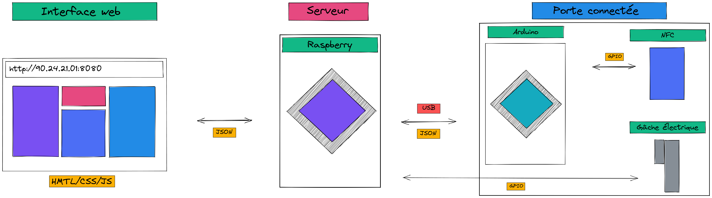
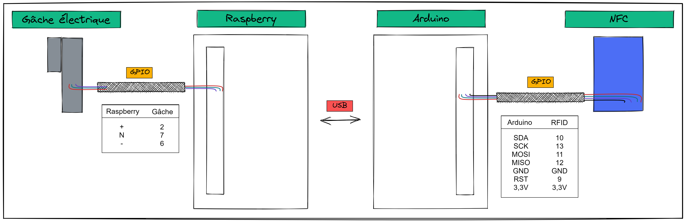

<h1>Projet LockDoor</h1>
<!-- TABLE OF CONTENTS -->
<details open="open">
  <summary><h2 style="display: inline-block">Table des matières</h2></summary>
  <ol>
    <li><a href="#Présentation">Présentation</a></li>
    <li><a href="#Fonctionnalités">Fonctionnalités</a></li>
    <li><a href="#Installation et lancement du projet">Installation et lancement du projet</a></li>
    <li><a href="#Installation de l'application mobile">Installation de l'application mobile</a></li>
    <li><a href="#Architecture">Architecture</a></li>
    <li><a href="#Contact">Contact</a></li>
  </ol>
</details>

## Présentation
Lors du module ProjetIoT d'une durée d'un an, nous avons réalisé un projet en lien avec la spécialité Internet of Things. L'objectif du projet est de réaliser une porte connectée qui peut être piloter en ligne à partir de l'interface web, ou bien sur place avec un lecteur de carte.

Plusieurs étapes permettent de mener à bien le projet :
1. Rédaction du cahier des charges
2. Réalisation de l’architecture
3. Choix des technologies de communication, des langages de programmation et du matériel
4. Réalisation du prototype matérielle
5. Réalisation du service avec une interface web
6. Communication entre le prototype et le service

## Composition du répertoire
Le répertoire est composé de plusieurs dossiers qui composent le projet :
1. Documentation qui recense le délivrable, mais aussi les travaux de recherches, la maquette de l'interface web, les schémas explicatifs et la gestion de projet.
2. BDD qui contient la base de données du projet
3. Porte qui contient le software du projet, c'est à dire le code pour l'implémentation du module RFID, NFC mais aussi l'interface web et le webserver.
4. Application qui contient l'application mobile
5. 
## Installation et lancement du projet

1. Cloner le répertoire
   ```sh
   git clone https://github.com/ESIR2-Lockdoor/LockdoorProject.git
   ```
2. Se positionner dans le répertoire LockdoorProject/Porte/Websocket
3. Installer les librairies suivantes à votre répertoire :
   ```sh
   npm install express
   npm install -D nodemon
   npm install onoff
   npm install socket.io

   ```
4. Lancer le projet grâce à la commande 
    ```sh
   npm run watch
    ```
5. Ouvrir l'interface web depuis votre navigateur avec l'url http://localhost:8080

## Installation de l'application mobile
Installer l'APK qui se trouve dans le dossier Application

## Architecture
Nous pouvons voir ci-dessous l'architecture général du projet :
  
  
  

## Contact
[@Mathis Certenais](https://www.linkedin.com/in/mathiscertenais/)
[@Corentin Grosos](https://www.linkedin.com/in/corentin-grosos-8092a719b/?originalSubdomain=fr)
[@Théo Delagarde](https://www.linkedin.com/in/th%C3%A9o-delagarde-029a35188/)
