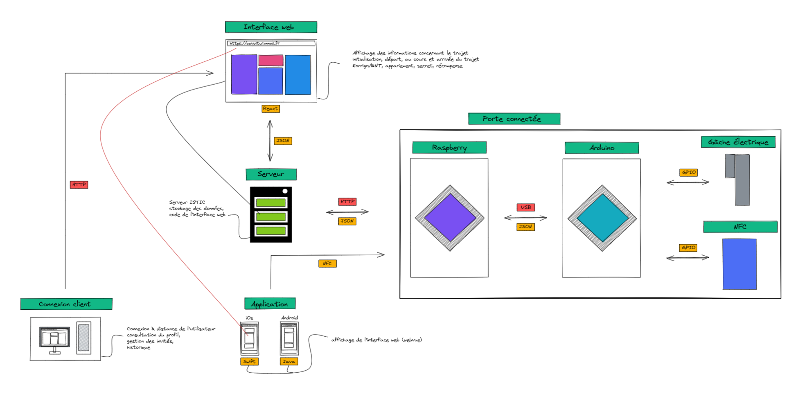

<h1>Projet LockDoor</h1>
<!-- TABLE OF CONTENTS -->
<details open="open">
  <summary><h2 style="display: inline-block">Table des matières</h2></summary>
  <ol>
    <li><a href="#Présentation">Présentation</a></li>
    <li><a href="#Fonctionnalités">Fonctionnalités</a></li>
    <li><a href="#Installation et lancement du projet">Installation et lancement du projet</a></li>
    <li><a href="#Installation de l'application mobile">Installation de l'application mobile</a></li>
    <li><a href="#Architecture">Architecture</a></li>
    <li><a href="#Contact">Contact</a></li>
  </ol>
</details>

## Présentation

Sur un module d'une vingtaine d'heure, nous avons réalisé un projet en lien avec la spécialité Internet of Things. L'objectif du projet est, à partir d'une page Internet ou de boutons poussoirs, de piloter la maquette KNX qui commande 4 LED. 

Plusieurs étapes permettent de mener à bien le projet :
1. Réalisation de l’architecture
2. Choix des langages de programmation
3. Création d'un serveur
4. Création d'une page web pour commander la maquette KNX
5. Communication client - serveur
6. Communication serveur - maquette KNX


## Composition du répertoire
Le répertoire est composé de plusieurs dossiers qui composent le projet :
1. Documentation qui recense le délivrable, mais aussi les travaux de recherches, la maquette de l'interface web, les schémas explicatifs et la gestion de projet.
2. BDD qui contient la base de données du projet
3. Porte qui contient le software du projet, c'est à dire le code pour l'implémentation du module RFID, NFC mais aussi l'interface web et le webserver.

## Installation et lancement du projet

1. Cloner le répertoire
   ```sh
   git clone https://github.com/ESIR2-RESIoT/project.git
   ```
2. Ouvrir le répertoire avec IntelliJ
3. Ajouter une nouvelle configuration sur le logiciel :


6. Se connecter au routeur de la maquette KNX, puis lancer la configuration. La console indiquera que la connexion a la maquette KNX est bien effectuée
7. Ouvrir l'interface web depuis votre navigateur avec l'url http://localhost:8080

## Installation de l'application mobile
Installer l'APK qui se trouve dans le dossier Application

## Architecture
Nous pouvons voir ci-dessous l'architecture général du projet :
  

## Contact

[@Mathis Certenais](https://www.linkedin.com/in/mathiscertenais/)
[@Corentin Grosos](https://www.linkedin.com/in/corentin-grosos-8092a719b/?originalSubdomain=fr)
[@Théo Delagarde](https://www.linkedin.com/in/th%C3%A9o-delagarde-029a35188/)
